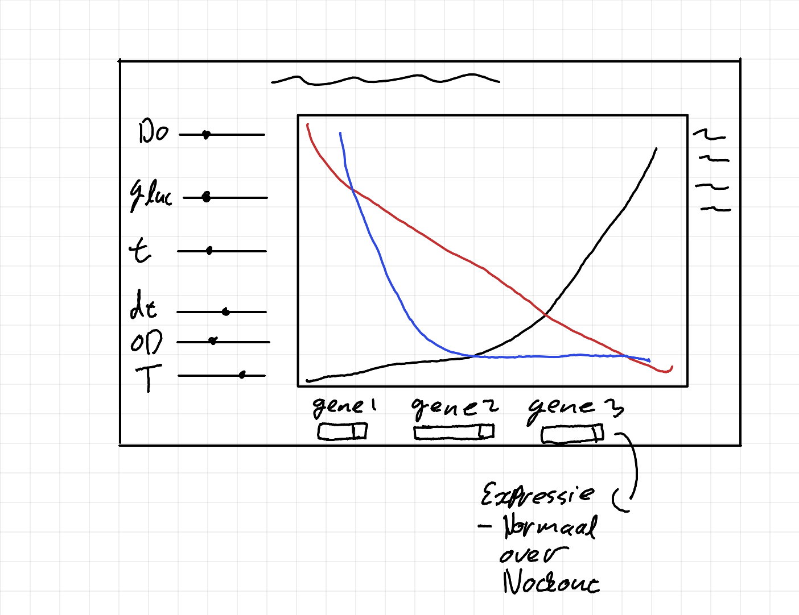
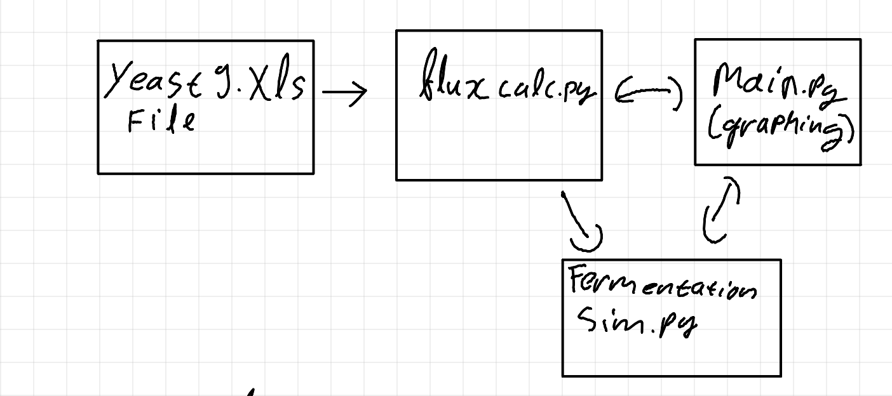

#Fermentation simulator

## 1 Beschrijving
### doel
Het doel is om een interactieve fermentatie simulatie te maken. Dit wil ik doen door geruik te maken van plotly en cobrapy.


de UI moet er ongeveer uit gaan zien als hier boven


dit moet de code structure worden (de bestanden)


## 2. uitvoering
1. Ik heb in eerste instantie een class gemaakt met waarin alle berekeningen worden uitgevoerd van de fermentaties. Vervolgens heb ik een eerste simulatie gerund en geplot in plotly. Hieruit kwam de volgende grafiek:
.png)

2. Het substraat lijkt nergens op, om te kijken of mijn berekeningen kloppen ga ik een  unit tests uitvoeren. Deze test print de tijd, biomassa en substraat
```
at: 5 min 
 biomass: 0.5333333333333333
 substrate: 9.964444444444444
at: 10 min 
 biomass: 1.421166221166221
 substrate: 9.869812586177302
at: 15 min 
 biomass: 3.779407822300338
 substrate: 9.618955040551528
at: 20 min 
 biomass: 9.99632856351841
 substrate: 8.96121832300679
at: 25 min 
 biomass: 26.037063801248166
 substrate: 7.289990154985479
at: 30 min 
 biomass: 64.647741349031
 substrate: 3.4553133811777585
at: 35 min 
 biomass: 130.69443757305393
 substrate: -1.8855914278261579
at: 40 min 
 biomass: -67.1250724890925
 substrate: -5.949620226375755
at: 45 min 
 biomass: -1118.5156123216375
 substrate: 694.8297993510527
at: 50 min 
 biomass: -3894.8262924367705
 substrate: 1081.5297332193338
at: 55 min 
 biomass: -13587.083927471163
 substrate: 2433.98561233886
at: 60 min 
 biomass: -47485.15883389941
 substrate: 7172.766883397825
at: 65 min 
 biomass: -166115.36105058296
 substrate: 23772.731467414193
at: 70 min 
 biomass: -581316.4365064069
 substrate: 81892.15115048877
at: 75 min 
 biomass: -2034518.8011762698
 substrate: 285331.6100863494
at: 80 min 
 biomass: -7120726.676104219
 substrate: 997391.7999311703
at: 85 min 
 biomass: -24922454.124968104
 substrate: 3489624.7186771855
at: 90 min 
 biomass: -87228500.16411251
 substrate: 12212462.236842606
at: 95 min 
 biomass: -305299661.2921684
 substrate: 42742415.86655155
```
hieruit blijkt dat er geen rekening is gehouden met het geit dat het substraat op kan raken. dit is te zien aan het feit dat alles alle kanten op gaat

3. nu een case toegevoegd waarbij de fermentatie ophoud als het substraat onder de 0 komt
```
at: 0 min 
 biomass: 0.2
 substrate: 10
at: 5 min 
 biomass: 0.5333333333333333
 substrate: 9.964444444444444
at: 10 min 
 biomass: 1.421166221166221
 substrate: 9.869812586177302
at: 15 min 
 biomass: 3.779407822300338
 substrate: 9.618955040551528
at: 20 min 
 biomass: 9.99632856351841
 substrate: 8.96121832300679
at: 25 min 
 biomass: 26.037063801248166
 substrate: 7.289990154985479
at: 30 min 
 biomass: 64.647741349031
 substrate: 3.4553133811777585
```

4. Nu dit goed gaat weer een plot gemaakt. biomassa staat nu als substraat in het plot
.png)

5. Niet de goede list ingevoerd bij de argumenten, nu wel gedaan
.png)

6. Reactor vollume is now 1 L, however it should be 3L this is  -> aanpassingen

7. run functionaliteit ingebouwd. Hier word de fermentatie door de class zelf gerund.

8. App werkt nu met dash, hierdoor wordt deze interactief.
.png)

9. de mu max is per uur. er wordt hier gerekend met munuten. dit is aangepast door het mu_max argument in de __init__ te delen door 60
.png)

10. Interactieve sliders toegevoegd. Ik heb eerst heel lang documentatie/tutorials door gelezen. Deze gaven alle niet wat ik precies zocht. Vervolgens heb ik chat.gpt gevraagd wat ik allemaal moest aanpassen voor om te komen naar een interactieve dash app. Ik heb gevraagd om niet het hele script te veranderen, alleen mij pointers te geven en om structuren van de sliders aan te geven. Hierna heb ik zelf alle aanpassingen gemaakt.
.png)

11. Layout aangepast, zodat de sliders links zitten en de grafiek rechts. Wederom aan chatgpt voor pointers gevraagd. De documentatie van plotly is (naar mijn mening) erg vaag/niet heel duidelijk


12. Dropdown menu toegevoegd voor het uitschakelen van genen. Nu ik weet waar ik naar moet zoeken is het iets makkelijker gegaan. Echter is dit nog niet goed uitgelijnd. (dropdown rechts ipv onder)

13. Dropdown mene nu wel onder de grafiek. inplaats van `column` had ik `columns` geschreven.

14. Meerdere dropdown menus gemaakt voor verschillende genen. Code can wellicht wat mooier, dit is echter voor later.


15. De gene dropdowns printen nu ook naar de console of ze WT/knockout zijn. Ook hebben alle dividers hun eigen file gekregen.

16. strain toegevoegd, code gecopiëerd vanuit week 3. deze werkt niet.
`OSError: The file with 'yeast-GEM.xml' does not exist, or is not an SBML string. Provide the path to an existing SBML file or a valid SBML string representation:`

17. `model = read_sbml_model("yeast-GEM.xml")` aangepast naar `model = read_sbml_model("strain/yeast-GEM.xml")`. Dit werkt nu wel, dit komt omdat de directory er nu ook bij staat.

18. knockout functie toegevoegd, moet een list geven met een tuple die met alle knockout genen. reterns list zonder inhoud

19. `knockout` bleek fout gespeld te zijn in startvalues. nu wel goede output `[(1, 'knockout'), (2, 'knockout')]`

18. Nieuwe elementen toe gevoegd voor fedbatch functionaliteit. Dit gedaan door documentatie te lezen. Niet alles ging in 1 keer goed. De checkbox renderde eerst niet. Beter de documentatie gelezen en nu renderd hij wel.

19. Alle elementen voor de interactiviteit naar de een nieuwe file verplaatst [dividers.py](dividers.py). 

20. Spelfout in code aangepast. (`vollume` -> `volume`)

21. vollume input werkt nu ook voor batch fermentaties.